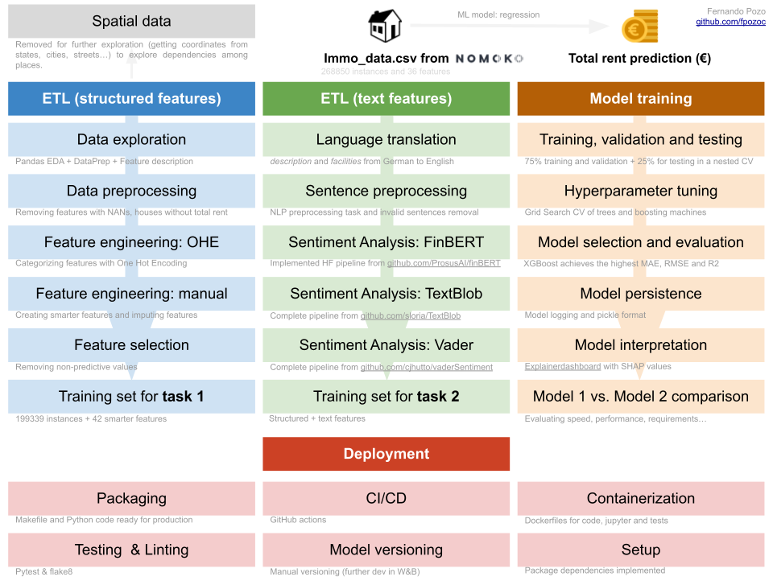

# Nomoko-ML-engineer-interview-task

[](https://pypi.org/project/kedro/)
[](https://github.com/)
[](https://github.com/psf/black)
 [](https://opensource.org/licenses/MIT)
 [](https://github.com/fpozoc/qsplice/blob/master/.pre-commit-config.yaml)

## Table of contents

- [Nomoko-ML-engineer-interview-task](#nomoko-ml-engineer-interview-task)
  - [Table of contents](#table-of-contents)
  - [Objective](#objective)
    - [Data](#data)
    - [Task](#task)
  - [Solution overview](#solution-overview)
    - [Task 1](#task-1)
    - [Task 2](#task-2)
    - [Extra requirements](#extra-requirements)
    - [Improvements](#improvements)
  - [Installation](#installation)
  - [Usage](#usage)
  - [Project structure](#project-structure)
  - [Author information](#author-information)
  - [Release History](#release-history)
  - [Contributing](#contributing)
  - [License](#license)
  - [TO-DO](#to-do)

--------------------------------------------------------------------------------


## Objective

**Interview Task for Machine Learning Engineer / Data Scientist Role**

### Data 

The data set contains rental property listings from a real estate platform with related information, such as living area size, rent, the location (street and house number, if available, ZIP code and state), type of energy etc. It also has two variables containing longer free text descriptions: description with a text describing the offer and facilities describing all available facilities, newest renovation etc. 

### Task

- 1. Please train a machine learning model to predict the total rent using only the structural data (without “description” and “facilities” fields).  
- 2. Please train a machine learning model to predict the total rent using both the structural data AND text data (“description” and “facilities” fields). 

We expect the performance reporting to conform to the expected ML best practices, i.e. please split the data set to necessary groups (train, validation, test). 

One can ignore some of the fields during prediction. Please provide some discussion on the feature processing, model selection, model performance and comparison of two models and any possible improvements. Please provide the trained ML model files as well.

We expect a git repo (link shared privately with us) that contains your solution in Python 3 language.

Additional points will be considered for DB schema design and access (postgreSQL preferred), model versioning, containerization, CI/CD and testing.

--------------------------------------------------------------------------------

## Solution overview


**Figure**: Nomoko-ML-engineer-interview-task solution. On the left side, the process of getting the training set for the first task is presented. In green, the NLP preprocessing and the dataset construction is shown. On the left side, the pipeline for the model training is presented. Finally, at the bottom, there are additional hints on the model and package deployment process.

The initial database `immo_data.csv` contains  268850 records and 36 features of real estate data from Germany.

The tasks to be performed here were split into two main parts:
- The first part in which only continuous, categorical, and boolean values from the initial dataset were used to construct a training set for the selected Machine Learning model. The objective was to predict the total rent of the property with a regression model. For this task, spatial data like names of states, cities, regions, zip codes and streets were discarded, but it is important to say that using these geographical coordinates can improve the model performance. Both `notebooks/01.eda.ipynb`, `src/data`, `src/features`  contains the code to perform this task.
- The second part, both `description` and `facilities` features are allowed to be added to the model. The objective was the same as before but this time, I can use this text data to predict the total rent of the property.
- All the code I have used to perform the previous task and for training the model has been saved in this repository. The `project_structure` can be found below. This has been implemented following the best routines for packaging, CI/CD, testing, linting, containerization, setup and even further deployment, model versioning, and correct documentation.

### Task 1

On the one hand, to create the training set for task 1, I used the following steps:
- **Data exploration** or EDA, where I took the opportunity to understand better every single feature to be used with optimal performance in the further model. Apart from `pandas`, `numpy`, and `matplotlib`, I used the `DataPrep` package to explore the data and to perform some basic data cleaning. The HTML preprocessing and postprocessing can be found in `reports` folder. Features description can be found grouped and sorted in `config/features.csv` or `config/features.yaml` files.
- **Data preprocessing** to remove some not-useful features with NANs and houses without `totalRent` (15.07% of the total) info available. I added a special ID with some house features to be used as a reference for the model. Finally, I removed the spatial data for this model.
- **Feature engineering** to transform the data to be used with the model. First, I converted the booleans (True/False) into integers (1/0), and then I transformed some categorical variables into dummy variables (One Hot Encoding). Notice that this step was performed considering every feature previously explored. For instance, I defined the `energyEfficiencyClass` in a way to be used by the model for the best performance (representing only three groups: A, B, and C). Details for other features can be found in `notebooks/01.eda.ipynb`.
- **Feature selection** to get the optimal number of predictive features for the model. The correlation matrix adds valuable insights into this process.
- I got **199339 instances + 42 more intelligent features** ready for task 1 after previous steps.
- **Model training** and **model selection** to train the model with the selected features. The model that achieved the best performance was the `XGBRegressor` model. To make this model selection, I used the `GridSearchCV` function, and I designed a strategy to follow a Nested Cross-Validation for selecting the optimal set of hyperparameters and to get the best model for this task. Other models like `DecisionTreeRegressor`, `RandomForestRegressor` or `GradientBoostingRegressor` were also tested. It is important to say that setting more models and a higher space of hyperparameters to be explored can improve the final model performance. This is why I have prepared in `src/model/model_selection.py` a complete script for doing this.
- **Model evaluation** and **model interpretation** to evaluate with different metrics evaluation and interpret how our model is running. The `ExplainerDashboard` package released an amazing HTML notebook for this exploration. The notebook can be found in `reports/interpretation.model.v1.0.0.html`.
- **Model persistence** to save the model in a file. The model can be used in the future to predict the total rent of the property. Now I have desinged a script to do this and also, to manually capture all the model logs. However, it is interesting to integrate it in a platform like Weight and Biases or MLflow to build better models at large scale.


### Task 2

On the other hand, I used the following steps to create the training set for task 2. In this step, text files were allowed, and the objective was to analyze features in the text data.
- **Language translation** was necessary to translate the text data into English. Most of the Natural Language Processing models have been optimized for this language. Therefore, I used the `deep-translator` Python library to get as much information as possible to perform a batch translation.
- **Sentence preprocessing** to prepare the text data for the translations and further Sentiment Analysis. Removing NANs, punctuation, stopwords, special characters were performed. In the following pipelines, both Tokenization, Stemming, and Lemmatization were performed.
- **Sentiment Analysis** to identify, extract, quantify, and study affective states and personal information. I have included different pipelines in the model to capture as much heterogeneity as possible. First, I added `FinBert`, a pre-trained NLP model to analyze the sentiment of the financial text. Moreover, I used the `TextBlob` library to analyze the sentiment of the text. This package provides a score for polarity (the orientation of the expressed sentiment) and subjectivity (personal opinion or not). Finally, I used the `VADER` (Valence Aware Dictionary and sEntiment Reasoner) library to use the compound score (a standardized score for measuring positive, neutral, or negative opinions in the same value).
- I got **8 extra features** ready for task 2 after the previous steps. This adds some additional features to the model that can predict the target and add precious information.


### Extra requirements

Finally, this repository includes a packaged version of the code (with complete documentation of the every function) to reproduce all this steps, reports and jupyter notebooks. Documentation can be further generated from this package. Some testing functions have been added and there are some CI/CD pipelines to be executed after pushing the code to the repository. Some docker images (for testing and production) have been created to run the code in a container. A Makefile is included to run the code in a production environment. Also, a linter (flake8) has been added to the code to check for any potential issues.

### Improvements

As I have already described, some improvements can be made to the model in the following steps. For instance, spatial data with coordinates can be beneficial here to add features like available living space, weather, trendy neighborhoods, population density, industries, services, etc. These features can be inferred from geographical information and could theoretically influence the total rent of a house. Also, complete testing of all functions, some extra CI/CD configurations, and a complete documentation can be added to this repository. To perform the model tracking, platforms like MLflow, Neptune or Weight and Biases can be used (I implemented it before [here](https://github.com/fpozoc/cxr-img-classifier/tree/main/configs/logger)). It also could be attractive to Fine-tuning a BERT model after some data labeling. Here I have used the fine-tuned model for financial text analysis to make it with our data should be beneficial.

## Installation

Run the silent installation of Miniconda/Anaconda in case you don't have this software in your environment.

```sh
wget https://repo.anaconda.com/miniconda/Miniconda3-latest-Linux-x86_64.sh
bash Miniconda3-latest-Linux-x86_64.sh -b -p $HOME/miniconda3
```

Once you have installed Miniconda/Anaconda, create a Python 3.10 environment.

```sh
conda create --name nomoko python=3.10
conda activate nomoko
```

Clone this repository and install it inside your recently created Conda environment.

## Usage


## Project structure

```sh
.                                                                                                                                                                           
├── config                                                                                                                                                                  
│   ├── features.csv                                                                                                                                                        
│   └── features.yaml                                                                                                                                                       
├── data                                                                                                                                                                    
│   ├── external                                                                                                                                                            
│   ├── interim                                                                                                                                                             
│   ├── processed                                                                                                                                                           
│   └── raw                                                                                                                                                                 
├── docker                                                                                                                                                                  
│   ├── jupyter.Dockerfile                                                                                                                                                  
│   ├── model.Dockerfile                                                                                                                                                    
│   └── test.Dockerfile                                                                                                                                                     
├── docker-compose.yml
├── docs
├── environment.yml
├── img
│   └── nomoko_task.png
├── LICENSE
├── Makefile
├── models
│   ├── model_selection_model.v.1.0.0_2022-07-22_17-56-48_849140.log
│   ├── model_selection_model.v.1.0.0.tsv
│   └── model.v.1.0.0.pkl
├── notebooks
│   ├── 01.eda.ipynb
│   ├── 02.task_1.ipynb
│   └── 03.task_2.ipynb
├── README.md
├── reports
│   ├── figures
│   └── html
├── run.sh
├── setup.py
├── src
│   ├── data
│   ├── features
│   ├── __init__.py
│   ├── model
│   ├── __pycache__
│   ├── utils
│   └── visualization
└── tests
    ├── __pycache__
    └── test_make_dataset.py
```

## Author information

Fernando Pozo

- [GitHub (github.com/fpozoc)](https://github.com/fpozoc)
- [Homepage (fpozoc.com)](https://fpozoc.com)

## Release History

**1.0.0** - Model for task 1 initial release (22 July 2022)

## Contributing

1. Fork it (<https://gitlab.com/bu_cnio/trifid>)
2. Create your feature branch (`git checkout -b feature/fooBar`)
3. Commit your changes (`git commit -am 'Add some fooBar'`)
4. Push to the branch (`git push origin feature/fooBar`)
5. Create a new Pull Request

## License

See `LICENSE` [file](LICENSE).

## TO-DO

Just added some to-do ideas if I continue working on this project.

- [ ] Implement an e2e model versioning solution like Weight and Biases, Neptune or MLFlow.
- [ ] Complete testing coverage and activate codecov.
- [ ] Setup dependabot.
- [ ] Create new GitHub actions for release drafter, pre-commit, labelers or documentation.
- [ ] Create a documentation webpage for the project.